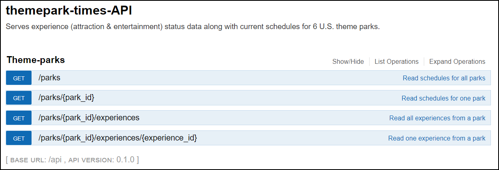

# themepark-times-API
> REST API serving real-time data for 6 U.S. Disney theme parks.

This is an educational project which pulls real-time data for 6 U.S. Disney theme parks from https://api.wdpro.disney.go.com on set time intervals, loads it into Redis, and serves it through a simple REST API built with Flask and Connexion. 

### Swagger UI


### Sample query


## Setup

Install Docker & Docker Compose if necessary.

Download project.
```sh
$ git clone https://github.com/erberlin/themepark-times-API.git
$ cd themepark-times-API
```

Edit .env file in project root to ajust update frequencies and change Redis password.

Launch project.
```sh
$ docker-compose -f docker-compose.base.yml -f docker-compose.prod.yml up
```

Visit http://127.0.0.1/api/ui/ in a browser to explore the available endpoints.

## Development setup

Coming.

## TODO
* Expand test suite
* API authentication
* Logging

## Disclaimer
This project is in no way affiliated with The Walt Disney Company or any of its subsidiaries. All use of Disney Services is subject to the [Disney Terms of Use](https://disneytermsofuse.com).

## Meta

Erik R Berlin – erberlin.dev@gmail.com

Distributed under the MIT license. See ``LICENSE`` for more information.

[https://github.com/erberlin/themepark-times-API](https://github.com/erberlin/themepark-times-API)